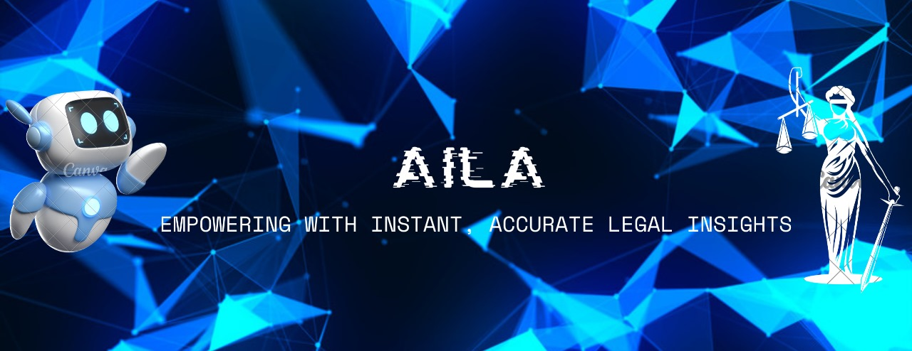

<h1 align="center">AILA</h1>
<h3 align="center">Know Your Rights! Better Citizen, Better Nation!</h1>

## About The Project
This project features an advanced NLP-based legal assistant designed to interpret and respond to queries about the Indian Penal Code (IPC). Leveraging Large Language Models (LLMs) and Retrieval-Augmented Generation (RAG) techniques, the chatbot provides accurate and contextually relevant legal information. Developed with Streamlit for an intuitive user interface, it enhances legal awareness and accessibility, offering reliable preliminary legal advice and detailed explanations.
 

### Check out the live demo on Hugging Face 

